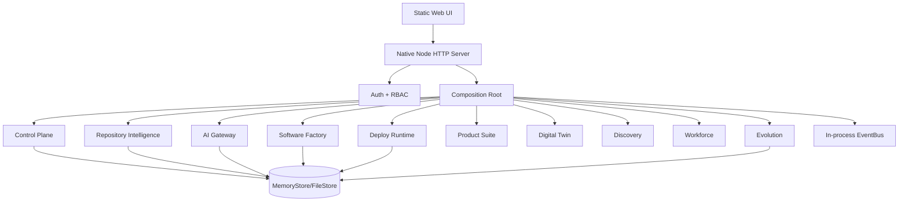
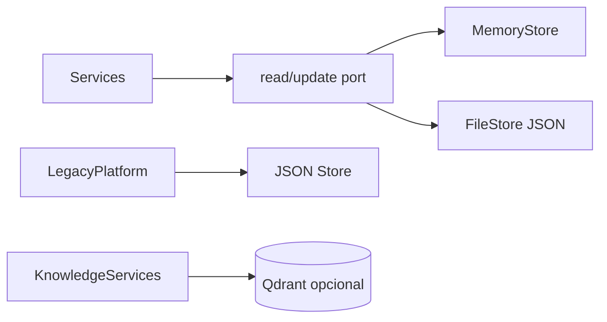

# Current Architecture — FÊNIX Alpha

## Contexto

O runtime principal é um monólito modular CommonJS em Node.js. O código aplica ports/adapters informalmente: serviços de domínio dependem de contratos simples (`store`, `bus`, providers) injetados pelo composition root.

## Containers lógicos

## Componentes

### Kernel

- `store.js`: estado transacional por clone/update; FileStore grava JSON atomicamente por rename.
- `event-bus.js`: publicação e assinatura no processo.
- `access-control.js`: mapa estático de permissões por papel.
- `errors.js` e `ids.js`: erros de domínio e identificadores.

### Control Plane e Security

`ControlPlane` gerencia tenants, usuários, memberships, organizações e clientes. `AuthService` usa scrypt e tokens aleatórios, mas guarda sessões num `Map`. O servidor aceita Bearer e, hoje, também headers de desenvolvimento.

### Intelligence Plane

Repository Intelligence extrai snapshots e capabilities. Digital Twin compõe snapshot, deploys, memória, grafo e insights. Discovery classifica capabilities contra um catálogo estático. Evolution deriva insights por heurísticas de eventos.

### AI Plane

`AIGateway` oferece roteamento por tarefa, fallback, cache exato, budget e telemetria. O Chat Agent possui uma cadeia de LLM separada (`AIPlatformProvider`/Ollama), criando dois caminhos de inferência que precisam convergir.

### Execution Plane

Software Factory gera projetos Node em disco. App Factory e Deployer expõem contratos corretos, mas seus defaults são simulados. Não há fila, worker separado, sandbox, scheduler ou limites de recursos.

## Persistência atual

PostgreSQL e SQL de control plane aparecem na plataforma anterior, mas não estão conectados ao composition root do `grg/`.

## Deployment atual

O servidor vincula em `127.0.0.1`. Deploy, rollback e builds de apps são registros determinísticos de domínio; não executam infraestrutura real. O `docker-compose.yml` da raiz sobe Qdrant e Docling, sem banco, Redis ou observabilidade.

## Limites arquiteturais recomendados

1. `SecurityPlane` deve ficar entre transports e casos de uso.
2. `ExecutionRuntime` deve ser o único autorizado a executar comandos, builds e deploys.
3. `StorePort`, `EventPublisher`, `SessionStore`, `AuditStore` e `ApprovalStore` devem ser contratos explícitos.
4. adapters locais permanecem em `infrastructure/local`; produção exige adapters verificados.
5. a cidade é projeção de leitura do kernel e nunca fonte de verdade.
