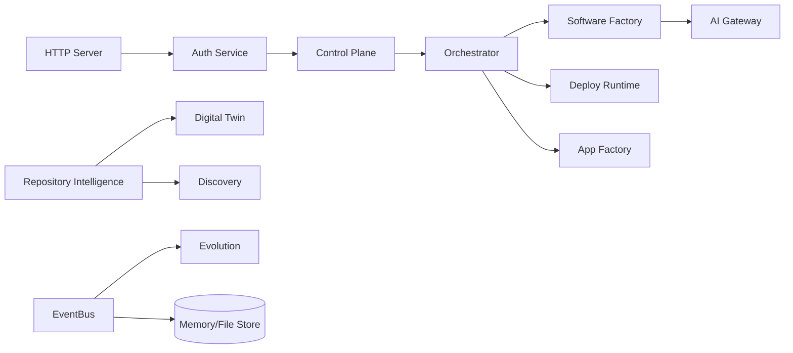

# GRG FÊNIX Enterprise Foundation — Audit

Data da fotografia: 2026-07-27. Escopo: `ai-engine/`, com foco no runtime executável `grg/`.

## Resultado executivo

O repositório contém uma prova arquitetural funcional do FÊNIX Alpha. O domínio principal está organizado como monólito modular com ports/adapters e possui testes de unidade e integração. A fundação não está pronta para produção porque persistência, autenticação, deploy, empacotamento e parte do gateway ainda usam adapters locais, memória de processo ou simulações.

Validação executada antes desta auditoria:

- `grg/`: 94 de 94 testes passaram.
- `engine/`: 4 de 4 testes passaram.
- `platform/`: 12 de 13 testes passaram; a falha foi `ENOTEMPTY` ao remover diretório temporário no Windows.
- Graphify: 1.473 nós, 2.228 relações e 127 comunidades.
- Saúde do grafo: 164 relações com endpoint pendente e 149 possíveis colapsos no modo não direcionado; dois arquivos SQL não foram extraídos por ausência do parser SQL.

## Módulos encontrados

| Plano | Implementação | Maturidade |
|---|---|---|
| Kernel | `grg/src/kernel` | Local funcional |
| Control Plane | `grg/src/control-plane` | Funcional, RBAC básico |
| Authentication | `grg/src/auth` | Parcial; sessão em memória |
| Repository Intelligence | `grg/src/repo-intel` | Funcional para GitHub/filesystem |
| AI Gateway | `grg/src/ai-runtime` | Parcial; factory usa Echo por padrão |
| Software Factory | `grg/src/software-factory` | Gera scaffold Node real e limitado |
| Runtime/Deploy | `grg/src/runtime` | Provider simulado |
| App Factory | `grg/src/app-factory` | Packagers simulados |
| Digital Twin | `grg/src/digital-twin` | Funcional para repositórios; dimensões pendentes |
| Evolution | `grg/src/evolution` | Heurísticas event-driven |
| Discovery | `grg/src/discovery` | Gap analysis de repositório |
| Workforce/City projection | `grg/src/workforce`, `grg/public` | Protótipo funcional |
| Product/Billing | `grg/src/product` | Domínio local, sem integrações reais |
| Legacy intelligence | `engine/` | Biblioteca paralela ainda não consolidada |
| Previous control plane | `platform/` | Implementação paralela/legada |

## Dependências e fluxo

`grg/src/app.js` é o composition root e concentra o wiring. `ControlPlane`, `MemoryStore/FileStore`, `EventBus` e `AIGateway` são dependências transversais. O fluxo principal é:

Não foram detectados ciclos de importação pelo Graphify. O principal risco estrutural não é ciclo: é duplicação de responsabilidades entre `engine/`, `platform/` e `grg/`.

## God objects e hubs

- `createApp()` possui 26 relações e é o composition root correto, mas crescerá demais sem módulos de configuração.
- `ControlPlane` possui 18 relações e concentra identidade, tenants, memberships e autorização.
- `AIGateway` possui 14 relações e é o ponto adequado para unificar modelos.
- `uuid()` aparece como maior hub por ser utilitário compartilhado; não representa, isoladamente, dívida arquitetural.

## Mocks e adapters locais

- `EchoProvider`: provider determinístico de teste/dev.
- `MockProviderAdapter`: deploy local simulado.
- `MockPackager`: artefatos simulados para PWA, desktop, Android, iOS e extensões.
- `MemoryStore` e `FileStore`: persistência de desenvolvimento.
- custos de IA: estimativa fixa, não catálogo versionado de preços.
- SSL/DNS e status de deploy: estados locais, sem provider real.

Mocks poderão permanecer em testes e desenvolvimento, mas devem ser recusados quando `FENIX_ENV=production`.

## Endpoints atuais

- público: `GET /health`, `POST /api/login`, `POST /api/logout`;
- contexto: `GET /api/me`, overview, projects, repositories, graph, telemetry, insights, evolution e twins;
- workforce: office, workforces, hire, daily report, standup, ask e building;
- discovery e repository analysis;
- factory generation, orchestration e chat.

Não existe versionamento `/api/v1`, OpenAPI, idempotency key, paginação padronizada ou envelope de erro com request ID.

## Eventos atuais

Eventos cobrem tenant, member, auth login, repository scan, AI invocation/cache, geração, deploy/rollback, app build, white-label, marketplace, billing, discovery, twin e evolution. O EventBus é em processo: não oferece durabilidade, replay, outbox, consumer offsets, DLQ ou entrega distribuída.

## Filas, caches e agendamento

- fila distribuída: inexistente;
- cache: arrays no store e caches locais no engine;
- cron/scheduler: inexistente;
- retry/circuit breaker: apenas timeouts pontuais;
- backup e disaster recovery: inexistentes no runtime GRG.

## Estado Git

O branch é `main`. Há centenas de exclusões preexistentes no legado e diretórios novos ainda não rastreados, incluindo `grg/`. Nenhuma estabilização deve incluir essas remoções implicitamente. Commits devem usar pathspec explícito e ser revisados antes da criação.

## Decisão

Preservar o domínio `grg/` e industrializar por adapters. A primeira vertical slice será Security Plane + auditoria + aprovação persistível; PostgreSQL/Redis/queue entram depois por feature flag e contratos, mantendo adapters locais exclusivamente para testes e desenvolvimento.
