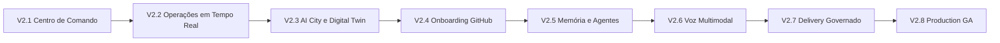

# GRG FÊNIX V2 — Roadmap de Produto

## Visão

O GRG FÊNIX V2 será um Sistema Operacional Cognitivo para observar, compreender e operar o ecossistema GRG. A experiência principal será um centro de comando vivo, e não um painel administrativo.

Princípios permanentes:

- o Kernel, a memória, o conhecimento, as políticas e a auditoria pertencem à GRG;
- modelos, STT e TTS são providers substituíveis acessados por gateways;
- a AI City e o Digital Twin são projeções de leitura, nunca fontes de verdade;
- toda mutação relevante passa por Runtime, autorização, aprovação e auditoria;
- onboarding de repositórios é somente leitura até autorização explícita posterior;
- cada memória possui tenant e escopo; nenhum contexto atravessa empresas ou projetos sem política explícita;
- cada marco precisa estar estável e comprovado antes do seguinte começar.

## Baseline existente

O V2 deve evoluir os componentes já presentes, sem criar implementações paralelas:

| Capacidade | Componente atual | Direção V2 |
|---|---|---|
| Roteamento de modelos | `src/ai-runtime/ai-gateway.js` | único ponto de entrada para LLMs |
| Execução governada | `src/runtime/job-engine.js` + BullMQ | fonte da fila operacional |
| Cidade | `src/ai-city/ai-city-projection.js` | projeção visual baseada em eventos |
| Infraestrutura | `src/digital-twin/digital-twin.js` | fonte do mapa operacional |
| GitHub | `src/repo-intel/github-connector.js` | onboarding inicialmente somente leitura |
| Memória | `src/memory/memory-engine.js` | ampliar escopos sem quebrar isolamento atual |
| Agentes | Workforce e Cognitive Core | papéis, ferramentas e políticas explícitas |
| Governança | Approval Engine + Audit Trail | controlar qualquer ação mutável |

## Sequência de marcos

### V2.1 — Fundação do Centro de Comando

Objetivo: substituir a percepção de dashboard por uma experiência operacional coerente, usando somente dados e APIs já existentes.

Entregas:

- App Shell com barra lateral, command bar, área de trabalho, painel contextual e central de notificações;
- navegação para Visão Geral, Operações, Cidade, Projetos, Conhecimento e Assistente;
- Design System FÊNIX com vermelho, preto e cinza, temas claro/escuro e tokens semânticos;
- estados de loading, vazio, degradado, offline e erro com tempo limite e recuperação;
- cartões de saúde e resumo do Digital Twin com origem e horário da última atualização;
- timeline somente leitura alimentada por eventos existentes;
- fila operacional somente leitura com tradução dos estados reais do Job Engine;
- painéis responsivos e reorganizáveis com preferências locais versionadas;
- Error Boundary global, correlation ID visível e zero exceções não tratadas no navegador;
- preservação temporária das rotas e funções da interface V1 durante a migração.

Fora do escopo:

- mapa gráfico completo da cidade;
- OAuth GitHub e clonagem de novos repositórios;
- STT/TTS;
- alteração automática de código, Pull Requests ou deploys iniciados pela nova UI;
- criação de outro Runtime, Gateway, grafo ou mecanismo de memória.

Critérios de aceite:

- nenhum dado crítico é simulado;
- nenhuma ação destrutiva é introduzida;
- toda chamada tem timeout, fallback e estado visual determinístico;
- navegação por teclado e contraste atendem WCAG 2.2 AA nos fluxos principais;
- zero erros JavaScript e zero loops de autenticação em testes de navegador;
- novos módulos possuem cobertura mínima de 95%;
- a suíte completa existente permanece verde;
- smoke test autenticado passa na VPS antes da aprovação do marco.

### V2.2 — Operações em Tempo Real

Objetivo: transformar eventos, jobs e deploys em uma visão operacional confiável.

Entregas:

- transporte de atualização em tempo real com reconexão e backoff;
- fila visual com Na fila, Em execução, Aguardando aprovação, Concluído, Falhou e Recuperando;
- modelo de estado explícito para aprovação e recuperação, sem inferência ambígua na interface;
- detalhes de execução, tentativas, limites, heartbeat, logs e correlation ID;
- ações governadas de cancelar, repetir e aprovar conforme RBAC;
- notificações e incidentes derivados de eventos auditáveis.

Gate: recuperação de conexão, idempotência e transições de estado comprovadas por testes.

### V2.3 — AI City e Digital Twin

Objetivo: representar visualmente projetos, serviços e infraestrutura sem substituir as fontes operacionais.

Entregas:

- canvas navegável com zoom, pan, minimapa, busca e filtros;
- prédios e entidades derivados da projeção existente da AI City;
- estados Saudável, Degradado, Offline, Atualizando, Executando e Criando;
- painel contextual com health, métricas, logs, dependências, jobs, eventos e versões;
- infraestrutura da VPS exibida pelo Digital Twin com timestamp e nível de confiança;
- virtualização e atualização incremental para mapas grandes.

Gate: reconstruir a cidade a partir do Event Store produz a mesma projeção observável.

### V2.4 — Onboarding GitHub somente leitura

Objetivo: incorporar projetos com segurança e gerar entendimento antes de qualquer modificação.

Pipeline:

1. conectar GitHub por OAuth, GitHub App ou credencial governada;
2. descobrir organizações e repositórios autorizados;
3. clonar com identidade somente leitura em workspace isolado;
4. extrair README, ADRs, CHANGELOG, Docker, CI, APIs, banco e dependências;
5. gerar relatório arquitetural, Knowledge Graph e Digital Twin;
6. posicionar o projeto na AI City;
7. registrar evidências, limitações e riscos.

Gate: nenhuma permissão de escrita é solicitada ou usada durante o onboarding.

### V2.5 — Memória hierárquica e agentes especializados

Objetivo: oferecer contexto durável sem vazamento entre domínios.

Entregas:

- escopos explícitos: global GRG, tenant/empresa, organização, projeto e agente;
- política de herança, precedência, retenção, proveniência e classificação;
- testes negativos de isolamento entre tenants, empresas, projetos e agentes;
- papéis Arquiteto, Desenvolvedor, DevOps, Analista, Comercial e Operações;
- ferramentas, permissões, orçamento e memória definidos por papel;
- Conselho Cognitivo com opiniões registradas e decisão final auditável.

Gate: consultas cruzadas só retornam conteúdo quando uma política explícita autoriza.

Programa federado detalhado:

1. **V2.5.1 — Hierarquia e isolamento:** identidades `fenix://`, workspaces, grants herdáveis, memória por escopo e políticas deny-by-default do Knowledge Hub.
2. **V2.5.2 — Agentes especializados:** contratos de ferramentas, orçamento, permissões e delegação obrigatória do Avatar Mestre.
3. **V2.5.3 — Onboarding cognitivo:** criação idempotente de workspace, memória, grafo, twin, agentes e nó da cidade após análise somente leitura.
4. **V2.5.4 — Inteligência entre projetos:** consultas federadas com evidência, classificação e política de compartilhamento.
5. **V2.5.5 — Evolução governada:** hipótese, simulação, aprovação, Runtime, PR, deploy e atualização das projeções.

O V2.5.1 estabelece a autoridade de escopo usada por todas as fatias seguintes. Nenhuma fatia posterior pode manter uma lista paralela de empresas, projetos, lojas ou agentes.

### Programa V2.5.2 — Engenharia autônoma governada

1. **V2.5.2.1 — Trusted Execution Foundation:** Docker Rootless, ferramentas registradas, scripts Ed25519 assinados, limites, limpeza e timeline reproduzível.
2. **V2.5.2.2 — Inspection & Reverse Engineering:** detecção estática, evidências, Knowledge Graph e Digital Twin sem executar código do projeto.
3. **V2.5.2.3 — Smoke & Playwright Runtime:** receitas assinadas para health, APIs e navegador, com artefatos e logs.
4. **V2.5.2.4 — Evolution Proposals:** riscos, gargalos, esforço, impacto e planos; nenhuma mutação.
5. **V2.5.2.5 — Governed Change Engine:** branch, implementação em sandbox, testes, SAST, PR, aprovação, merge e deploy.
6. **V2.5.2.6 — Operational Experience:** fila, progresso, recursos, logs, screenshots e histórico em tempo real.

O gate V2.5.2 completo só fecha após todas essas fatias. A existência do Sandbox isoladamente não autoriza declarar a plataforma autônoma concluída.

### V2.6 — Assistente multimodal

Objetivo: permitir conversa por texto e voz sem acoplar providers à experiência.

Fluxo obrigatório:

`Cliente → STT Gateway → Conversation Layer → AI Gateway → TTS Gateway → Cliente`

Entregas:

- contratos `transcribe`, `synthesize`, `stream`, `health`, `models`, `cost` e `fallback`;
- streaming de áudio e texto com cancelamento;
- seleção e fallback independentes para STT, LLM e TTS;
- consentimento, retenção e exclusão de áudio;
- telemetria de latência, custo e qualidade por etapa.

Gate: trocar um provider não exige alteração na UI nem no Cognitive Core.

### V2.7 — GitHub → Runtime → VPS governado

Objetivo: executar mudanças auditáveis somente depois que o projeto estiver autorizado.

Pipeline:

`Plano → Aprovação → Branch → Implementação → Testes → Pull Request → Aprovação → Merge → Artefato → Deploy → Smoke Test → Atualização da City/Twin/Version Engine`

Entregas:

- ambientes isolados e credenciais de curta duração;
- policy gates por risco;
- artefatos imutáveis e SBOM;
- deploy, rollback, backup e restore rastreáveis;
- atualização transacional das projeções após resultado confirmado.

Gate: nenhuma mudança chega à branch protegida ou à VPS sem evidência e aprovação exigidas pela política.

### V2.8 — Production GA

Objetivo: aprovar o FÊNIX V2 para operação contínua.

Entregas:

- testes de carga, caos, recuperação e segurança;
- SLOs, alertas e runbooks;
- observabilidade completa com métricas, logs e traces correlacionados;
- instalação, upgrade, rollback, backup e restore em VPS limpa;
- acessibilidade, performance e segurança validadas externamente.

Gate: checklist de produção comprovado por evidências em ambiente novo.

## Governança de entrega

Cada marco segue o mesmo ciclo:

1. registrar ADRs e contratos antes da implementação;
2. dividir o marco em fatias verticais pequenas e demonstráveis;
3. implementar uma fatia por vez com feature flag quando necessário;
4. executar testes unitários, integração, contrato, navegador e smoke test;
5. atualizar documentação, Knowledge Graph e matriz de riscos;
6. publicar evidências e obter aprovação do gate;
7. somente então iniciar o marco seguinte.

Regras de bloqueio:

- falha na suíte existente bloqueia avanço;
- vulnerabilidade crítica bloqueia release;
- dado simulado apresentado como real bloqueia aceite;
- ação sem auditoria, autorização ou idempotência bloqueia aceite;
- regressão de autenticação, isolamento de tenant ou recuperação bloqueia release.

## Primeira fatia executável do V2.1

A primeira implementação deve conter apenas:

1. tokens do Design System e temas claro/escuro;
2. App Shell responsivo com navegação e command bar;
3. página Visão Geral consumindo `/api/overview` e `/health`;
4. estados seguros de loading, erro, sessão expirada e atualização;
5. testes de navegador para login, refresh, timeout, fallback e navegação.

Essa fatia não altera regras de negócio. Ela estabelece a base visual e operacional para as demais telas do V2.1.
