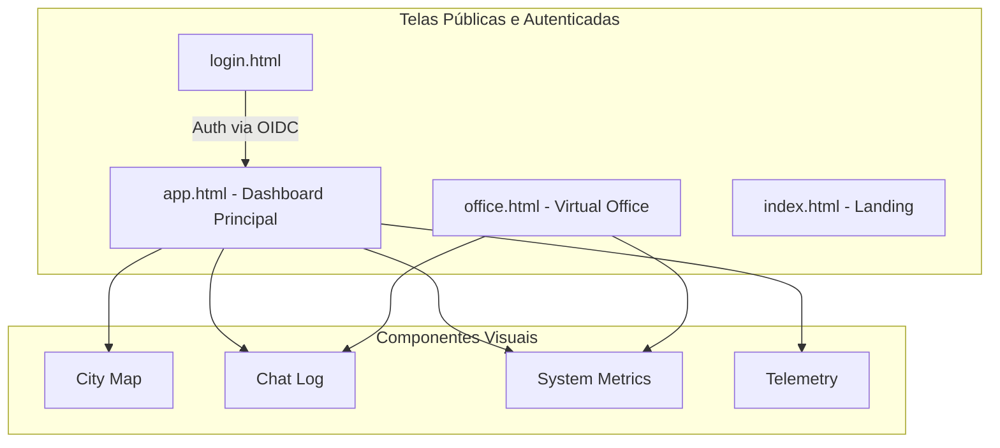
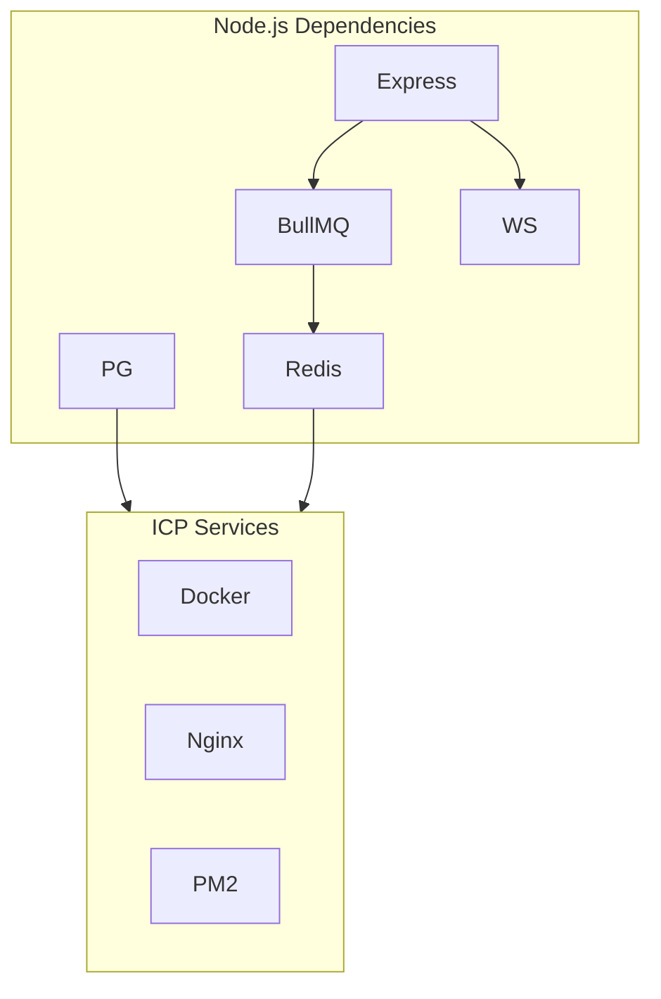
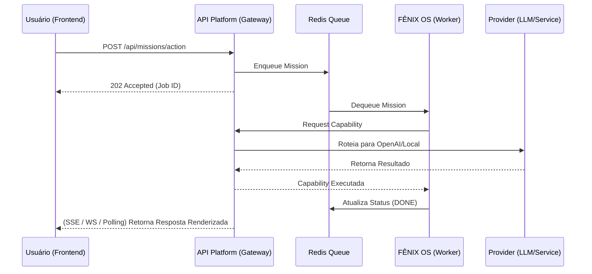

# FÊNIX OS + API Platform — Arquitetura Viva e Grafos de Sistema

Este documento contém a memória arquitetural 100% atualizada do sistema. Ele servirá como fundação para a estabilização e testes automatizados. Os grafos abaixo descrevem o estado e dependências da aplicação.

---

## 1. SYSTEM GRAPH (Macro Arquitetura)

```mermaid
graph TD
    %% Frontend Layer
    subgraph Frontend [UI Layer (public/)]
        HTML[Telas HTML: app, office, index]
        CSS[Design System CSS]
        JS[App/Office JS]
        HTML --> CSS
        HTML --> JS
    end

    %% Fenix OS
    subgraph FenixOS [FÊNIX OS]
        ME[Mission Engine]
        CM[Capability Manager]
        AE[Autonomous Evolution]
    end

    %% API Platform (Backend)
    subgraph APIPlatform [API Platform]
        AG[API Gateway / Server.js]
        QR[Queue Engine / BullMQ]
        PR[Provider Resolver]
        SE[Streaming Engine]
    end

    %% Providers & Infra
    subgraph Infra [Infraestrutura e Provedores]
        LLM[OpenAI / Claude / Gemini / Ollama]
        DB[(PostgreSQL)]
        Cache[(Redis)]
        Mem[(Qdrant / Memory)]
    end

    %% Fluxo de Dados
    JS -- REST/WebSocket --> AG
    FenixOS -- Consome --> AG
    AG --> PR
    AG --> QR
    QR --> DB & Cache
    PR --> LLM
    PR --> Mem
```

---

## 2. UI GRAPH (Inventário Macro de Telas)



---

## 3. ROUTE GRAPH (Mapeamento de APIs)

```mermaid
graph LR
    subgraph Gateway [Express Router (server.js)]
        direction TB
        Auth[/api/oidc/*]
        Ops[/api/operations/*]
        Miss[/api/missions/*]
        Health[/health]
        Perf[/api/performance/*]
    end

    subgraph Controllers [Controllers / Handlers]
        AH[Auth Handler]
        OH[Operations State]
        MH[Mission Kernel]
        PH[Performance Engine]
    end

    Auth --> AH
    Ops --> OH
    Miss --> MH
    Perf --> PH
    Health --> |Ping| Infra
```

---

## 4. DEPENDENCY GRAPH (Bibliotecas e Serviços)



---

## 5. EXECUTION GRAPH (Ciclo de Vida de uma Missão)



---
*Graphfy Memory — Salvo com Sucesso no Registro Permanente.*
