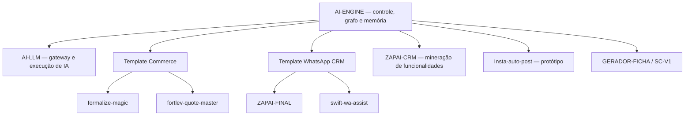

# Análise dos repositórios Biel0071

Data da fotografia: 22 de julho de 2026. Esta é uma análise estática dos 10 repositórios no `main`, feita por clone raso e registrada por commit. Não foram copiados segredos para a memória e os sistemas não foram iniciados contra bancos ou serviços externos.

## Resumo executivo

O portfólio já contém as peças de uma software house assistida por IA, mas hoje elas estão espalhadas e duplicadas. O desenho recomendado é:

Existem 8 repositórios com implementação e 2 reservados/vazios. As duas maiores oportunidades são transformar projetos quase iguais em produtos canônicos com configuração por tenant:

- `formalize-magic` × `fortlev-quote-master`: 550 arquivos idênticos no mesmo caminho e similaridade de conteúdo de 0,775.
- `ZAPAI-FINAL` × `swift-wa-assist`: 1.539 arquivos idênticos no mesmo caminho e similaridade de conteúdo de 0,845.

## O que é cada projeto

| Projeto | O que é | Papel recomendado |
|---|---|---|
| **AI-ENGINE** | Motor de análise, memória e orquestração, com CRM incorporado e control plane multitenant. | Painel central e fonte da memória de todos os projetos. |
| **AI-LLM** | Gateway multitenant de modelos de IA com provedores, filas, cache, métricas, workers e SDKs. | Camada única para chamadas de IA do portfólio. |
| **formalize-magic** | SaaS multiloja de catálogo, orçamento, checkout, pagamento, administração, IA e recursos de moda/experimentação virtual. | Template canônico da família commerce. |
| **fortlev-quote-master** | Variante commerce focada em catálogo, orçamento, checkout e administração de loja. | Configuração/edição por tenant derivada do template commerce. |
| **ZAPAI-FINAL** | CRM completo para WhatsApp: sessões, inbox, contatos, leads, campanhas, automações, IA, memória, métricas e deploy VPS. | Núcleo canônico da família WhatsApp CRM. |
| **swift-wa-assist** | Variante avançada do CRM WhatsApp, com admin master, nós, deployments, logs e operação multicliente. | Distribuição/configuração de tenant do núcleo ZAPAI. |
| **ZAPAI-CRM** | CRM WhatsApp anterior ou alternativo, menor e estruturado em backend/frontend separados. | Fonte legada para comparar e reaproveitar funcionalidades. |
| **Insta-auto-post** | Extensão Chrome que coleta URLs, baixa mídia, gera legendas via OpenAI e gerencia uma fila. | Protótipo a reconstruir com backend seguro e API oficial. |
| **GERADOR-FICHA** | Repositório com somente README, sem implementação. | Ideia no backlog até definir requisitos. |
| **SC-V1** | Repositório efetivamente vazio. | Backlog não classificado. |

## Diagnóstico por repositório

### AI-ENGINE

- Commit: `785cae5ee0c4063b35cd23b113e0425a3871f9b7`
- Evidência analisada: 525 arquivos relevantes, sendo 402 de código e 123 de documentação.
- Stack predominante: Node.js, Express, OpenAI, Qdrant, Tree-sitter, Docker e um CRM React/TypeScript.
- Valor: é a melhor base para centralizar cadastro, análise, grafo, memória, permissões e deploy dos demais projetos.
- Atenção: separar responsabilidades do motor central e do CRM; consolidar os pontos de entrada; substituir o catálogo estático por sincronização GitHub versionada.

### AI-LLM

- Commit: `bba24e8138565a6c554827a4270d4f3dbb63c957`
- Evidência: 100 arquivos relevantes, monorepo com `apps/api`, `apps/worker`, `apps/dashboard` e `packages`.
- Stack: TypeScript, Fastify, Prisma/PostgreSQL, Redis/BullMQ, Docker e SDKs.
- Valor: evita que cada sistema implemente OpenAI, Claude, Gemini, Ollama e outros provedores separadamente.
- Atenção: definir uma fronteira simples — AI-ENGINE decide e orquestra; AI-LLM executa modelos, filas, quotas e telemetria.

### formalize-magic

- Commit: `f10e247a8ca5611bcc2fc5bd16a412daf2d97591`
- Evidência: 602 arquivos relevantes; React/TypeScript no frontend e Supabase com muitas migrations e Edge Functions.
- Capacidades: lojas, conta/admin, catálogo, banners, SEO, tracking, checkout, orçamento/PDF, pagamentos Allowpay, importação e enriquecimento de produtos, chat da loja, criação de loja por IA e funções de moda.
- Valor: é a edição mais ampla da família commerce e deve se tornar o template principal.
- Atenção: documentar o produto real; o README atual é genérico e não representa a amplitude do sistema.

### fortlev-quote-master

- Commit: `cbe03c8275da18baac357699523e3892759d9f21`
- Evidência: 547 arquivos relevantes; mesma arquitetura React/Supabase da família commerce.
- Capacidades: catálogo, orçamento, checkout, pagamentos, administração e automações de produto/loja.
- Valor: boa prova de que uma solução base pode ser especializada para um cliente.
- Atenção: não manter as correções em paralelo. As diferenças devem virar tema, configuração, feature flag ou módulo do tenant.

### ZAPAI-FINAL

- Commit: `77788193cca780c56d61f05766292a1124c0ff50`
- Evidência: 1.183 arquivos relevantes. O grafo persistido anteriormente registrou 4.964 nós e 9.564 relações no commit `e735f033`.
- Stack: Node/Express/Socket.IO/Baileys/PostgreSQL, React/TypeScript/Vite/Zustand, OpenAI, PM2/Nginx/Docker.
- Capacidades: inbox, contatos, conversas, mensagens, sessões WhatsApp, campanhas, automações, IA, memória evolutiva, analytics, deploy e testes.
- Valor: é a base mais madura da família CRM WhatsApp.
- Atenção: atualizar o grafo para o HEAD, consolidar camadas legadas e manter Baileys atrás de um adaptador substituível.

### swift-wa-assist

- Commit: `64152c6bde1dcbdfa601b650a6443e1c939ee3cc`
- Evidência: 913 arquivos relevantes; rotas e telas de admin master, nós, deployments, logs, memória, IA, campanhas e WhatsApp.
- Valor: contém a visão operacional/multinó importante para a software house.
- Atenção: 1.539 arquivos são idênticos ao ZAPAI-FINAL no mesmo caminho. Migrar as diferenças úteis para módulos do núcleo e parar de duplicar a árvore completa.

### ZAPAI-CRM

- Commit: `72f80789e9afebc4bf4e84ce3d38b7e44aa19318`
- Evidência: 324 arquivos relevantes, backend em `backend/crm` e frontend React/Vite.
- Capacidades: chat, conexões, contatos, campanhas, automação, respostas rápidas e configuração de IA.
- Valor: fonte de requisitos e fluxos que podem ter sido simplificados ou perdidos nas versões maiores.
- Atenção: a igualdade exata com ZAPAI-FINAL é muito baixa. Comparar por funcionalidade e contrato, não tentar mesclar diretórios automaticamente.

### Insta-auto-post

- Commit: `e51a6e7f730410579b3c0796757f65d39c3f261e`
- Evidência: extensão Manifest V3 com `background.js`, `content.js` e `popup.js`.
- Capacidades reais: URLs, scraping, download por SaveClip, fila, estatísticas e geração de legenda.
- Limite importante: `postToInstagram` apenas simula sucesso; não publica de fato.
- Segurança: a chave OpenAI fica no `chrome.storage.local` e é enviada diretamente da extensão. Para produção, mover IA e tokens para backend, usar OAuth e a API oficial da Meta.

### GERADOR-FICHA

- Commit: `92cd448089c39ac7b33c4ba7b8daaab57128797a`
- Possui apenas README/licença/configuração Git. Ainda não há código ou arquitetura para analisar.

### SC-V1

- Commit: `83e42dec21f703f69956731d683f6df99016c7c0`
- Possui somente `.gitignore`. A finalidade precisa ser definida antes de entrar no catálogo de produtos ativos.

## Padrão recomendado para evolução

1. `AI-ENGINE` mantém tenants, projetos, commits analisados, grafo, memória, permissões, execuções e deployments.
2. `AI-LLM` é o gateway único de modelos; nenhum produto guarda chave de provedor no navegador.
3. Cada família tem um núcleo canônico e edições por configuração: `commerce-core` e `whatsapp-crm-core`.
4. Funcionalidades reutilizáveis recebem identidade estável, versão, dependências, permissões e testes antes de serem copiadas/ativadas.
5. Toda memória deve guardar evidência: repositório, commit, arquivo, símbolo e data. Inferência nunca deve virar fato sem validação.
6. Webhooks do GitHub iniciam nova análise somente quando o commit muda; o resultado anterior permanece auditável.
7. Deploy precisa usar adaptadores por destino, ambientes separados e aprovação para produção.

## Próximas entregas sugeridas

1. Conector GitHub App/OAuth para sincronizar automaticamente repositórios privados, branches, commits e webhooks.
2. Worker de análise incremental que atualiza o grafo por commit.
3. Tela “Famílias e variantes” mostrando arquivos comuns e diferenças entre Formalize/Fortlev e ZAPAI/Swift.
4. Registro de componentes reutilizáveis com contratos, testes e feature flags.
5. Pipeline de deploy com preview, staging, produção, rollback e trilha de auditoria.

Os dados estruturados desta fotografia estão em `platform/data/repository-analysis-2026-07-22.json`.
